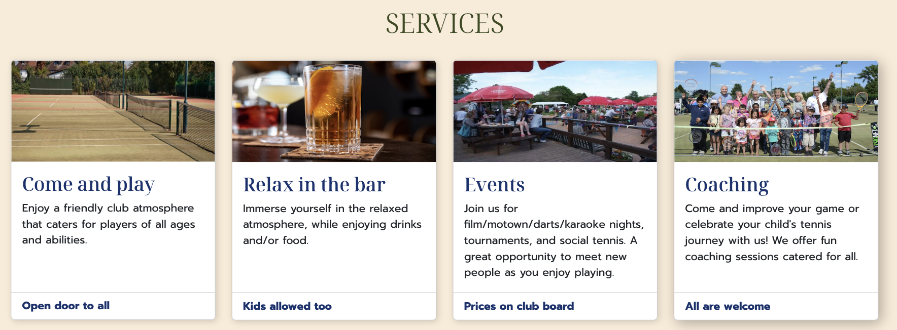
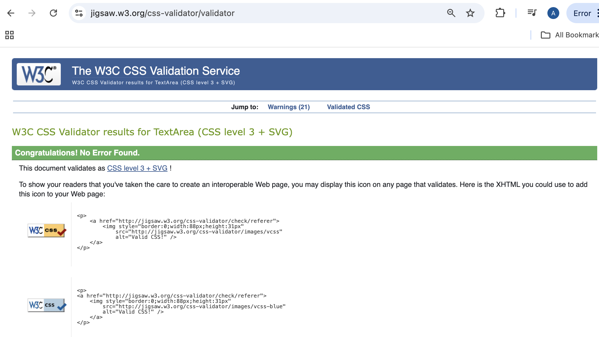

<!-- START doctoc generated TOC please keep comment here to allow auto update -->
<!-- DON'T EDIT THIS SECTION, INSTEAD RE-RUN doctoc TO UPDATE -->

- [Richings Tennis](#richings-tennis)
  - [Planning](#planning)
  - [Requirements](#requirements)
  - [User Stories](#user-stories)
      - [As a First-Time Visitor, I need easy navigation and a user-friendly design, including a responsive layout for my device, so I can find information quickly and efficiently without frustration.](#as-a-first-time-visitor-i-need-easy-navigation-and-a-user-friendly-design-including-a-responsive-layout-for-my-device-so-i-can-find-information-quickly-and-efficiently-without-frustration)
      - [As a Casual player, I want to see high-quality images and engaging descriptions of the bar's ambience and tennis courts, so I can decide if it's the right place for me to relax and have fun.](#as-a-casual-player-i-want-to-see-high-quality-images-and-engaging-descriptions-of-the-bars-ambience-and-tennis-courts-so-i-can-decide-if-its-the-right-place-for-me-to-relax-and-have-fun)
      - [As a tennis newbie I want to explore a selection of coaching options on the website, so I can decide which ones suit me or my child.](#as-a-tennis-newbie-i-want-to-explore-a-selection-of-coaching-options-on-the-website-so-i-can-decide-which-ones-suit-me-or-my-child)
      - [As a Prospective Customer, I need to find essential information such as location, contact details, and opening hours clearly and concisely, so I can easily plan my visit or get in touch with the club.](#as-a-prospective-customer-i-need-to-find-essential-information-such-as-location-contact-details-and-opening-hours-clearly-and-concisely-so-i-can-easily-plan-my-visit-or-get-in-touch-with-the-club)
      - [As a potential customer, I want to be able to initiate a simple membership inquiry form, so I may be contacted by the membership team.](#as-a-potential-customer-i-want-to-be-able-to-initiate-a-simple-membership-inquiry-form-so-i-may-be-contacted-by-the-membership-team)
      - [As a keen player, I want to find clear information about upcoming events and pricing, so I can plan my visit within my budget and time constraints.](#as-a-keen-player-i-want-to-find-clear-information-about-upcoming-events-and-pricing-so-i-can-plan-my-visit-within-my-budget-and-time-constraints)
  - [Features](#features)
      - [All pages on the website have](#all-pages-on-the-website-have)
      - [The home page](#the-home-page)
      - [The Coaching page](#the-coaching-page)
      - [The Membership form page](#the-membership-form-page)
      - [The form success page](#the-form-success-page)
    - [Features left to implement](#features-left-to-implement)
  - [Code](#code)
      - [Files](#files)
      - [Code format](#code-format)
  - [Testing](#testing)
      - [Accessibility](#accessibility)
      - [HTML](#html)
      - [CSS](#css)
  - [Bugs](#bugs)
      - [I had to replace a large image asset. When I tried to push that to GitHub it was not appearing in the repo. So, in order to fix this I renamed the replacement file. This somehow allowed the deleted image file to be deleted from the repo.](#i-had-to-replace-a-large-image-asset-when-i-tried-to-push-that-to-github-it-was-not-appearing-in-the-repo-so-in-order-to-fix-this-i-renamed-the-replacement-file-this-somehow-allowed-the-deleted-image-file-to-be-deleted-from-the-repo)
      - [The fixed-top navbar was covering the header of a section whenever the internal link on the navbar was clicked on. I had to check in DevTools how many pixels I needed to push the header down by in order for it to not be covered. Then I added padding-top to the body.](#the-fixed-top-navbar-was-covering-the-header-of-a-section-whenever-the-internal-link-on-the-navbar-was-clicked-on-i-had-to-check-in-devtools-how-many-pixels-i-needed-to-push-the-header-down-by-in-order-for-it-to-not-be-covered-then-i-added-padding-top-to-the-body)
      - [I was not able to change the background colour of a Bootstrap table. I had to use \* as a CSS selector.](#i-was-not-able-to-change-the-background-colour-of-a-bootstrap-table-i-had-to-use-%5C-as-a-css-selector)
    - [Unfixed Bugs](#unfixed-bugs)
  - [Deployment](#deployment)
    - [Version Control](#version-control)
  - [Wireframes](#wireframes)
  - [Credits](#credits)

<!-- END doctoc generated TOC please keep comment here to allow auto update -->

# Richings Tennis

## Planning

-   The Richings Tennis club website's business goal is to increase membership.

-   The club is run by a commitee that includes a chairman, treasurer, club secretary and others.

## Requirements

-   They need an elegant solution to be designed that showcases the club's services and it's friendly all-inclusive atmosphere.

-   The website should illustrate the all-weather tennis courts, the coaching services, friendly club atmosphere, tennis leagues, social sessions, the bar.

-   Designed for anyone who wants to socialise, whether that person is into tennis or not. Tennis enthusiasts will be presented with essential information around coaching, leagues, social tennis and tournaments.

-   Users will be able to submit a convenient membership inquiry form and find out how to contact club staff. The site is responsive, adapting seamlessly to all screen sizes.


---

## User Stories

#### As a First-Time Visitor, I need easy navigation and a user-friendly design, including a responsive layout for my device, so I can find information quickly and efficiently without frustration.

-   The site applies responsive design principles using Bootstrap to ensure the website is accessible on various devices.
-   The site layout and navigation are based on best practices, ensuring all key sections and pages are easily accessible.

#### As a Casual player, I want to see high-quality images and engaging descriptions of the bar's ambience and tennis courts, so I can decide if it's the right place for me to relax and have fun.

-   The site integrates high-quality images of the bar and some of the available courts into the website using a carousel.
-   Embeds engaging descriptions for the bar's ambience and list of services available within the site's content.
-   The homepage layout is designed and implemented using images and descriptions that feature prominently.

#### As a tennis newbie I want to explore a selection of coaching options on the website, so I can decide which ones suit me or my child.

-   A responsive coaching page can be linked to featuring coaching sessions and their relevant details.

#### As a Prospective Customer, I need to find essential information such as location, contact details, and opening hours clearly and concisely, so I can easily plan my visit or get in touch with the club.

-   The design and placement of a section for location, contact details, and opening hours using information provided by the client is contained within the footer.
-   The contact section is clearly visible and accessible from all parts of the website, adhering to common design standards.

#### As a potential customer, I want to be able to initiate a simple membership inquiry form, so I may be contacted by the membership team.

-   A membership inquiry form has been implemented on the website.
-   The form implements HTML validation to fit the requirements above.
-   A success page to direct users to after submitting the form has also been implemented.

#### As a keen player, I want to find clear information about upcoming events and pricing, so I can plan my visit within my budget and time constraints.

-   The events section displays pricing for events using the provided rate information.
-   It also clearly display student discount information with the pricing for events.

---

## Features

The website is comprised of 4 pages, two of which are accessible from the navigation menu (Home, Coaching, Membership). The last one is a button that opens a membership inquiry form.

#### All pages on the website have

-   Clear Navigation: Easily navigate through different sections of the website, including Home, Services, Events, Coaching and Contact, situated to the right.
-   Responsive Design: Navigation bar adapts gracefully to various screen sizes, ensuring optimal usability whether you're browsing on a desktop, tablet, or mobile device situated in the burger-icon that expands when you click it. I used media queries for the different screen sizes.
    [Adaptive card sizes consistent](https://github.com/AmitKapilaCodeIns/tennis-club/compare/ba689d2d571f57819a0ba75d99d154c98fd6f6e8...2c40a1f2fd0c8e7aa5846b1170ee82c17c9c67d4)
-   The header: At the top left in the header section, there is the website logo, that will take the user to the home page when clicked.
-   The website logo and all pages use the main color theme; greens, blues and shades of white. The favicon adopts this theme. The primary colour choice of dark green and the secondary colour choice of light green reflect the colours a visitor might see. The navbar has light colours against a dark background contrasting each other well. The background is a light colour that contains the cards and other elements in a simple way.
-   The buttons are styled to match the overall look and feel of the site.
    [Navbar buttons use custom styling](https://github.com/AmitKapilaCodeIns/tennis-club/compare/cb7680af33262c3b0a04a0398db6a8705b21417f...501e0f9df51ed96b1a960e60a40209c0798d1a2c)
    [Buttons on the page are also styled](https://github.com/AmitKapilaCodeIns/tennis-club/compare/a076573f8f9bba63e1169bb4e1d66d5136f00ae7...908ae2c77ae83d1886cd4863750053cea69472bd)
-   The primary font Prompt was chosen for it's harmonious and simple feel. The secondary Noto Serif elegantly makes large text stand out without looking ungainly.
-   The icons used were chosen for their obvious meaning and purpose so that they can be understood by everyone.
    
-   Dynamic Footer: the website boasts a dynamic footer section that provides essential links, such as social media profiles, contact information, and opening times, ensuring easy access to relevant content and enhancing user engagement. The text is clearly contrasted standing out against the background. This helps the visually impaired to see information clearly. When the telephone number is clicked on the user is prompted to initiate a phone call & when the email address is clicked on a new email window is initiated, enhancing customer engagement.
    

#### The home page

-   The website features an engaging homepage designed to increase awareness of tennis club, provide essential information and encourage event participation. With stunning visuals, concise messaging, and intuitive navigation.
    

    -   The services section highlights the diverse range of things available to members. It's role is to introduce visitors to Riching's engaging offerings, be they the all-weather tennis courts, the coaching services, friendly club atmosphere, tennis leagues, social sessions and the bar. The aim is to show the club will fulfill the needs of casual players looking for all year-round tennis in a fun and relaxed atmosphere or enthusiasts looking to play competitive team tennis and join leagues. Parents looking to encourage their kid’s tennis skills will also find the club satisfies that need. Furthermore, the layout of the services section has been optimized for responsiveness using CSS Grid. This ensures that the services are displayed in varying numbers of columns, depending on the screen size, providing an optimal viewing experience across different devices. Each card has a nice 3D effect. In addition the card simulates being raised when hovered over.
        
    -   The events section details specific events held weekly. It allows visitors to decide on what events they are interested in and whether the timings suit them.
        

#### The Coaching page

-   Discover the LTA approved coaching options available to a broad demographic. Each type of coaching service has a helpful description and to what type of person it is tailored to. The experienced coaches are here to offer encouragement and support. Coaching session information includes the Date, Time and the Age group it is catered to. Furthermore, the layout of the coaching page section has been optimized for responsiveness using CSS Grid. This ensures that the options are displayed in varying numbers of columns, depending on the screen size, providing an optimal viewing experience across different devices. Each card has a nice 3D effect. In addition the card simulates being raised when hovered over.
    

#### The Membership form page

-   Each page on the site contains a button that allows the visitor to submit a membership inquiry form that satisfies the need to increase membership. A simple and intuitive form allows visitors to make that first step in becoming a member. It allows the client to make contact with the club and the trained club staff to discuss membership in a personal manner. The submit button is clearly displayed and set apart from neighbouring elements.
    

#### The form success page

-   Once a visitor submits a membership inquiry form they want assurance that the form was submitted. They are redirected to a simple page thanking them for their interest. messageand intuitive form allows to make that first step in becoming a member. It allows the client to make contact with the club and the trained club staff to discuss membership in a personal manner.
    

### Features left to implement

-   I would like to add a static section on the website for customer testimonials and populate this section with a selection of pre-written testimonials.
-   I would like to integrate a newsletter sign-up form into the website footer.

---

## Code

#### Files

-   Files are grouped in directories by file type
-   

#### Code format

-   VS code automatically indents HTML and CSS to ease readability

```
 <!-- Footer / contact -->
    <!-- will not be part of the grid structure as it spans the full width of the page. -->
    <footer id="contact" class="mt-auto">
        <div class="container section">
            <!-- justify-content-center: Want the columns to be centred on xl screens -->
            <div class="row justify-content-center">
                <div class="col-12 text-center">
                    <h2 class="display-6">Contact us!</h2>
                </div>
                <!-- Contact info want 4 on XL screens so that they do not spread to the sides-->
                <div class="col-12 col-md-6 col-xl-4">
                    <h3 class="sub-heading-color">Contact info</h3>
                    <address>
                        <strong><i class="fa-solid fa-location-dot"></i> Richings Tennis</strong><br>
                        123 Acacia Avenue<br>
                        Tillett, Herts, 12345
                    </address>
                    <p><i class="fa-solid fa-phone"></i> <a class="linkcolor" href="tel:0123456789"> 012 345
                            6789</a><br>
                        <i class="fa-regular fa-paper-plane"></i> <a class="linkcolor"
                            href="mailto:info@richings-tennis.co">Email us</a>
                    </p>
```

-   CSS code hierarchy is ordered, labelled and formatted to allow developers to quickly understand the rationale

```
    /* Google fonts import*/
    @import url("https://fonts.googleapis.com/css2?family=Noto+Serif+Display:ital,wght@0,100..900;1,100..900&family=Prompt:ital,wght@0,100;0,200;0,300;0,400;0,500;0,600;0,700;0,800;0,900;1,100;1,200;1,300;1,400;1,500;1,600;1,700;1,800;1,900&display=swap");

    /* CSS Variables */
    :root {
        --primary-font: "Prompt", sans-serif;
        --secondary-font: "Noto Serif Display", serif;
        --primary-color: #3a4a21; /* dark green */
        --secondary-color: #c4c097; /* light green */
        --highlight-color: #16316f; /* blue */
        --highlight-color-light: #7a9fc2; /* light blue */
    }

    /* Global styles */

    body {
        font-family: var(--primary-font);
        padding-top: 56px; /* pushes the top of the header down under fixed navbar */
        background-color: antiquewhite;
    }

    h1,
    h2,
    h3 {
        font-family: var(--secondary-font);
        color: var(--primary-color);
    }
    h1,
    h2 {
        text-transform: uppercase;
    }

    h2 {
        margin-bottom: 2rem;
    }
```

---

## Testing

#### Accessibility

-   I used Lighthouse within the Chrome Developer Tools to allow me to test the performance, accessibility, best practices and SEO of the website. I confirmed that the colors and fonts are easy to read and that the site is accessible.

    -   **INDEX PAGE**
        
    -   **COACHING PAGE**
        
    -   **Membership PAGE**
        
    -   **Membership PAGE**
        

-   The website was tested on Chrome, Mozilla, Edge and Safari browsers with no problems found.
-   Links: Tested and confirmed that each link refer to each page, worked as expected,and redirecting the user between the pages
    
-   Tested all links, to social media sites leading to external pages opened correctly in a seperate browser tab.
-   I tested and confirmed that the Membership form works, all fields are required, the email field only accepts email, and the submit button works perfectly in the end to submit the form, with a message back from the thank you page.
    

#### HTML

-   [HTML Validator](https://validator.w3.org/#validate_by_upload) was run each page of the project. A syntax error was found in the footer of all 4 pages.
    
    The error was fixed. At the final stage no errors or warnings were found.
    
    
    
    

#### CSS

-   [Vendor prefixes](https://autoprefixer.github.io/) Used Autoprefixer to parse the CSS and add vendor prefixes.
-   [CSS Validator](https://validator.w3.org/#validate_by_upload) some syntax errors were identified.
    
-   These were fixed.
    

---

## Bugs

-   Initially, when clicking on the navbar links to the sections in the page the h2 header was covered by the navbar.
    
-   By adding padding to the top of the section class the navbar was not covering the h2 header.

-   On smaller screens, the navbar did not close when clicking on links to sections on the same page.
    
-   Fixed by adding javaScript to ensure the navbar closes when clicking internal links

```
    <script>
        document
            .querySelectorAll(".navbar-collapse .nav-link")
            .forEach((link) => {
                link.addEventListener("click", function (e) {
                    let section = document.querySelector(e.target.getAttribute("href"));
                    if (section) {
                        e.preventDefault(); // Prevent default anchor click behavior
                        let navbarHeight = document.querySelector(".navbar-toggler").offsetHeight;
                        window.scroll({
                            top: section.offsetTop - navbarHeight, // Adjust for navbar height
                            behavior: "smooth",
                        });
                        document
                            .querySelector(".navbar-collapse")
                            .classList.remove("show"); // Collapse navbar
                    }
                });
            });
    </script>
```

#### I had to replace a large image asset. When I tried to push that to GitHub it was not appearing in the repo. So, in order to fix this I renamed the replacement file. This somehow allowed the deleted image file to be deleted from the repo.

-   [Bugfix to delete file on repo](https://github.com/AmitKapilaCodeIns/tennis-club/compare/5474cd5bdff2bc2f4289bc806a652bd0a98db0b0...512305eb514cce6057a4e709d4de88f598b40a72#diff-0eb547304658805aad788d320f10bf1f292797b5e6d745a3bf617584da017051L86)

#### The fixed-top navbar was covering the header of a section whenever the internal link on the navbar was clicked on. I had to check in DevTools how many pixels I needed to push the header down by in order for it to not be covered. Then I added padding-top to the body.

-   [Bugfix to stop navbar obscuring headers](https://github.com/AmitKapilaCodeIns/tennis-club/compare/167eb3717597efd9cc4a3b36cf25faf8dfbe54d0...6f7e0e82e1cb63093db849d14555564d279757a1)

-   The Bootstrap events table was overflowing on small screens.
    [Bugfix overlapping events table](https://github.com/AmitKapilaCodeIns/tennis-club/compare/2f67dc090bad30c761d04fb20eeda84cb017ecf5...8f8173609f23150e8b13dfb6fce4ec60e94832c1)

-   The Bootstrap events table size is set back to 1rem in a media query for sm screens and up.
    [Bugfix increase font size](https://github.com/AmitKapilaCodeIns/tennis-club/compare/8f8173609f23150e8b13dfb6fce4ec60e94832c1...167eb3717597efd9cc4a3b36cf25faf8dfbe54d0)

#### I was not able to change the background colour of a Bootstrap table. I had to use \* as a CSS selector.

-   [Bugfix table not changing colour](https://github.com/AmitKapilaCodeIns/tennis-club/compare/17edca5109c3c6e08cbb86c7e560721d333d4817...c74ec5f58c8f92211730b6764ffcc385ea83de8d)

---

### Unfixed Bugs

All bugs identified were fixed

## Deployment

### Version Control

-   The site was created using VS Code as IDE and pushed to Github to the remote repository 'tennis-club'.
-   Git commands were employed extensively during development to push the code to the remote repository. The sequence of Git commands utilized includes:
    -   **git add .**: This command adds the files to the staging area, preparing them for commitment.
    -   **git commit -m "commit message"**: It commits the changes to the local repository queue, marking them as ready for the final step.
    -   **git push**: This command is executed to push all committed code to the remote repository on Github.
    ### Deployment to Github pages
    The site was deployed to GitHub pages. The steps taken to deploy are as follows:
    1. Log in to [Github](https://github.com/);
    2. Navigate to [AmitKapilaCodeIns/tennis-club](https://github.com/AmitKapilaCodeIns/tennis-club) in the list of repositories;
    3. In the GitHub repository, navigate to the Settings tab;
    4. In Settings scroll down to GitHub pages which opens in a new page;
    5. From the source section drop-down menu, select the Master Branch;
    6. Once the master branch has been selected, the page is automatically refreshed and a display indicates the successful deployment and the link to the address.
       The live live link can be acess here: [Richings Tennis](https://amitkapilacodeins.github.io/tennis-club/index.html)
    ### Cloning Repository Code locally
    -   To clone the repository code locally, follow these steps:
    1. Navigate to the Github repository you wish to clone;
    2. Click on the "Code" button located above all the project files;
    3. Select "HTTPS" and copy the repository link;
    4. Open the IDE of your choice and paste the copied git URL into the IDE terminal;
    5. Press Enter to execute the command;
    6. The project will now be created as a local clone in your IDE.

---

## Wireframes

-   These wireframes were created using Balsamiq during the Scope Plane part of the design and planning process for this project. The site was developed with the Desktop layout method first. The wireframes were therefore drawn with that thought in mind and adapted along of the project, and created with [Balsamiq](https://balsamiq.cloud/) . First picture: Home page, Second picture: Coaching page, Third picture: Member page, Fourth picture: Thank you page.
    
    
    
    
    ***

---

## Credits

-   I would like to extend a special thanks to my tutor [Spencer Barriball](https://www.linkedin.com/in/spencerbarriball/), whose guidance and support have been invaluable throughout this journey.
    ### Content
-   The icons in the footer and in the headings were taken from:[Font Awesome](https://fontawesome.com/).
-   The Logo and Favicon was created by Ylivdesign from:[flaticon.com](https://www.flaticon.com/free-icons/tenniscamp).
-   I took inspiration from the Love Running project to create the header, hero-image section and footer. Other parts were inspired by [w3schools](https://www.w3schools.com/)
-   [Google fonts](https://fonts.google.com/) were used to import the fonts into the style.css file which is used on all pages throughout the project.
    [WebAIM](https://webaim.org/resources/contrastchecker/) were used to contrast the color palettes, into the style.css file which is used on all pages throughout the project.
-   Part of the English content in this website was generated with the assistance of [AI-ChatGPT](https://chat.openai.com/), an AI language model developed by OpenAI.
-   [Mockup](https://websitemockupgenerator.com) was used to create the mockup.

    ### Media

-   All the images in eache page of the site: Home, Services and Member was taken from: [Pexels](https://www.pexels.com/).
-   The video in the home page as taken as well from [Pexels](https://www.pexels.com/).
-   For a better performance of the website, the images was resizes and changed the format to WEBP using the [Birme](https://www.birme.net/) website.

[def]: .documentation/checkmylinks.png
