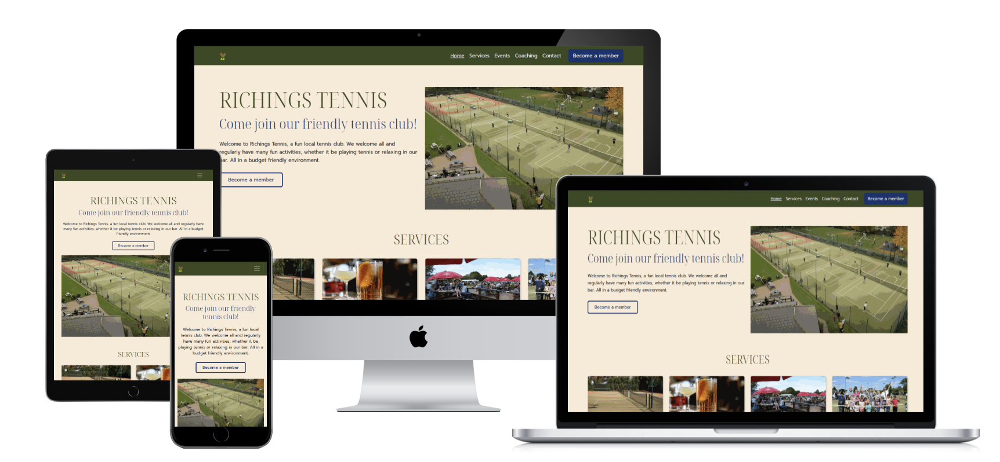

# Richings Tennis

The Richings Tennis club website's business goal is to increase membership. The site is an elegant solution to the need to showcase the club's services and it's friendly all-inclusive atmosphere.

The website illustrates the all-weather tennis courts, the coaching services, friendly club atmosphere, tennis leagues, social sessions, the bar.

Designed for anyone who wants to socialise, whether that person is into tennis or not. Tennis enthusiasts will be presented with essential information around coaching, leagues, social tennis and tournaments.

Users will be able to submit a convenient membership inquiry form and find out how to contact club staff. The site is responsive, adapting seamlessly to all screen sizes.

